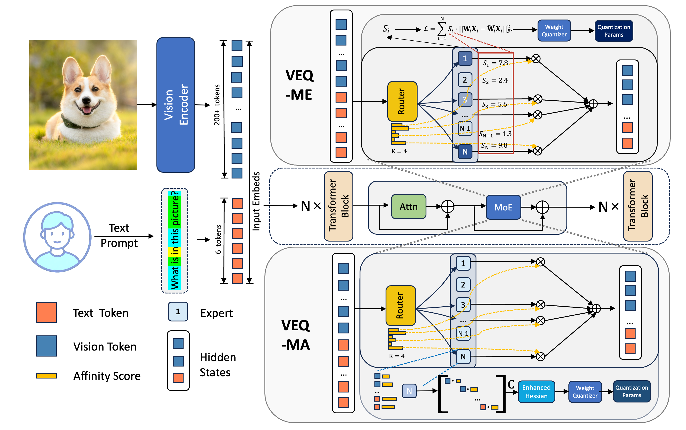
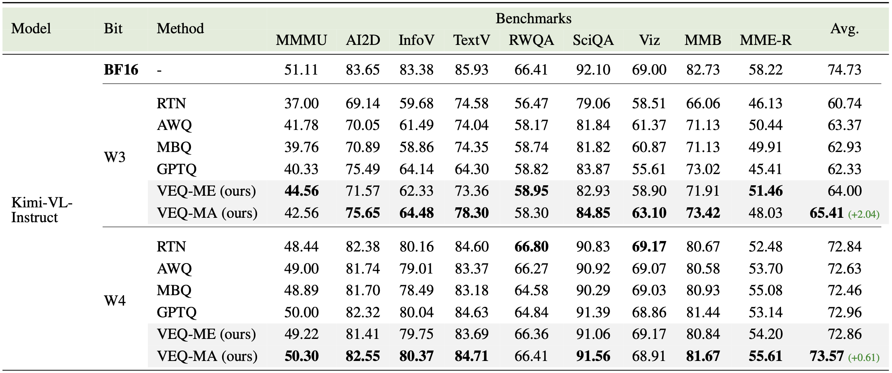
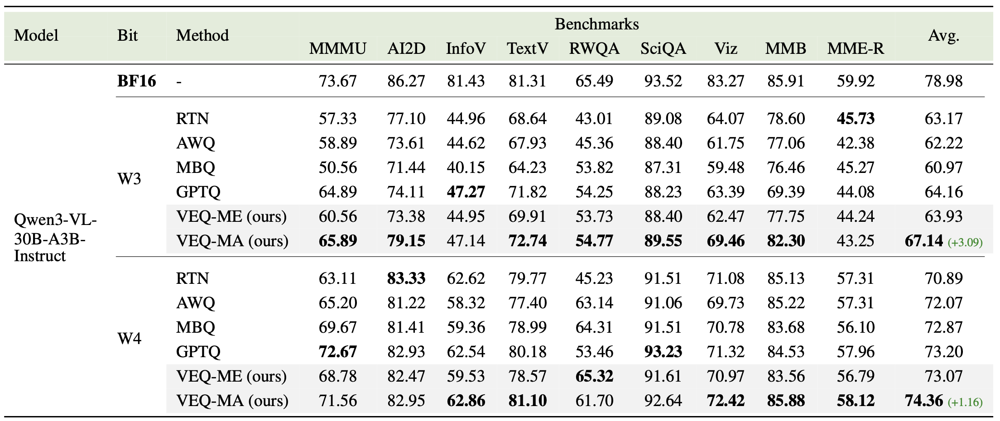
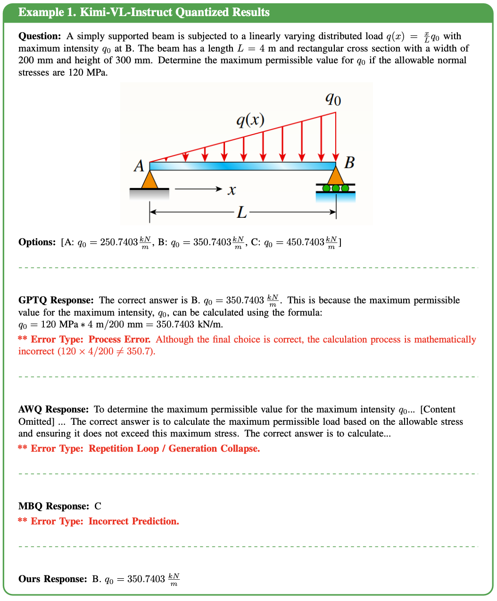
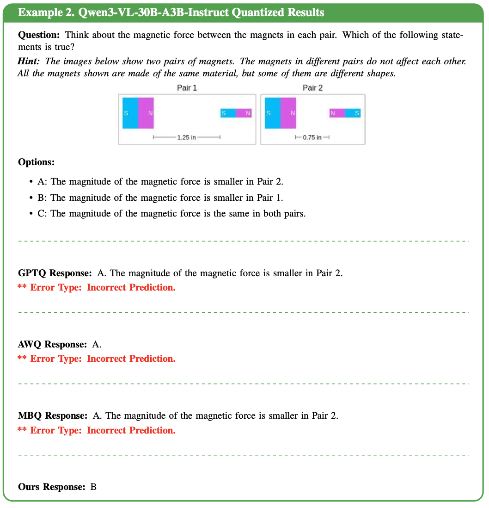

<h2>
VEQ: Modality-Adaptive Quantization for MoE Vision-Language Models
</h2>

[Guangshuo Qin](https://github.com/qsstcl), [Zhiteng Li](https://zhitengli.github.io), [Zheng Chen](https://zheng-chen.cn/), Weihang Zhang, [Linghe Kong](https://www.cs.sjtu.edu.cn/~linghe.kong/) and [Yulun Zhang](http://yulunzhang.com/)
[[arXiv](https://arxiv.org
)] [[supplementary material](https://github.com/)]


#### 🔥🔥🔥 News

- **2026-01-31:** This repo is released.

---

> **Abstract:** Mixture-of-Experts(MoE) Vision-Language Models (VLMs) offer remarkable performance but incur prohibitive memory and computational costs, making compression essential. Post-Training Quantization (PTQ) is an effective training-free technique to address the massive memory and computation overhead. Existing quantization paradigms fall short as they are oblivious to two critical forms of heterogeneity: the inherent discrepancy between vision and language tokens, and the non-uniform contribution of different experts. To bridge this gap, we propose Visual Expert Quantization (VEQ), a dual-aware quantization framework designed to simultaneously accommodate cross-modal differences and heterogeneity between experts. Specifically, VEQ incorporates 1) Modality-expert-aware Quantization, which utilizes expert activation frequency to prioritize error minimization for pivotal experts, and 2) Modality-affinity-aware Quantization, which constructs an enhanced Hessian matrix by integrating token-expert affinity with modality information to guide the calibration process. Extensive experiments across diverse benchmarks verify that VEQ consistently outperforms state-of-the-art baselines. Specifically, under the W3A16 configuration, our method achieves significant average accuracy gains of 2.04\% on Kimi-VL and 3.09\% on Qwen3-VL compared to the previous SOTA quantization methods, demonstrating superior robustness across various multimodal tasks. Our code will be available at https://github.com/qsstcl/VEQ.


## ⚒️ TODO
 
* [x] Complete this repository
* [ ] Release the code

## 🔗 Contents

- [X] [Results](#results)
- [X] [Citation](#citation)
- [X] [Acknowledgements](#-acknowledgements)


# <a name="results"></a>🔎 Results

We achieve significant average accuracy gains of 2.04\% on Kimi-VL and 3.09\% on Qwen3-VL compared to the previous SOTA quantization methods

Detailed results can be found in the paper.

<details>
<summary>&ensp;Quantitative Comparisons (click to expand) </summary>
<li> Performance comparison of various methods on Kimi-VL-Instruct. 
 
<p align="center">

</p>
</li>
<li> Performance comparison of various methods on Qwen3-VL-30B-A3B-Instruct. 
<p align="center">

</p>
</li>
</details>

<details open>
<summary>&ensp;Some examples on downstream tasks </summary>

<p align="center">

</p>
<p align="center">

</p>
</details>


## Citation

If you find the code helpful in your research or work, please cite the following paper.

```

```

## 💡 Acknowledgements

This work is released under the Apache 2.0 license.